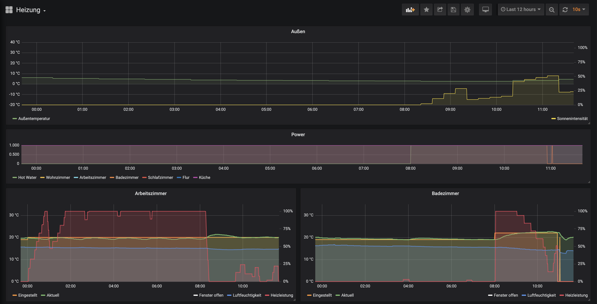

# Tado exporter

[](https://github.com/easimon/tado-exporter/packages)
[](https://github.com/easimon/tado-exporter/actions?query=workflow%3A%22JDK%20compatibility%20tests%22)

A simple Prometheus exporter for Tado° smart home installations, scraping temperatures, humidity etc. from the Tado° API.

Idea taken from [this python variant](https://github.com/vide/tado-exporter).

Since the python exporter failed to scrape the API quite often, and I wanted to experiment with
[Micronaut](https://micronaut.io/) anyway, I decided to rebuild this in Kotlin/Micronaut.

## Building

Clone this repository, copy
[./src/test/resources/application-test.yml.template](./src/test/resources/application-test.yml.template) to
[./src/test/resources/application-test.yml](./src/test/resources/application-test.yml) and set your Tado° username and
password.

Either install a JDK (tested with OpenJDK 8) and run `./mvnw package` to create an executable JAR only,
or install Docker and use `docker build . -t tado-exporter:latest` to create a Docker image.

## Usage

Configure username and password as environment variables (`TADO_USERNAME` and `TADO_PASSWORD`, respectively),
and start the exporter. The server then listens on port 8080 (plain HTTP), prometheus metrics are
available at `http://host:8080/prometheus`.

### Configuration

The minimal required configuration is a valid Tado° userame and password.
For complete list of configurable items and their defaults, see
[./src/main/resources/application.yml](./src/main/resources/application.yml)

| Environment variable | Description             | Required |
|----------------------|-------------------------|----------|
| TADO_USERNAME        | Tado° account username  | yes      |
| TADO_PASSWORD        | Tado° account password  | yes      |
| TADO_CLIENT_ID       | API OAuth client ID     | no       |
| TADO_CLIENT_SECRET   | API OAuth client secret | no       |
| TADO_SCOPE           | API OAuth Scope         | no       |
| TADO_ZONE_DISCOVERY_INTERVAL | Interval to refresh home and zone (room) information for the given account | no |
| TADO_API_CACHE_INTERVAL | Interval to cache API calls for zone and weather information. Should be something like the prometheus step interval, minus the duration it takes to scrape the API once (5-10 secs). | no |
| TADO_PROMETHEUS_STEP_INTERVAL | Prometheus step resulution (how often does prometheus scrape the metrics endpoint) | no |

OAuth client id, secret and scope do not need configuration, since they have defaults found at other projects listed in [References](#references).

### Prometheus scraping config

```yaml
scrape_configs:
  - job_name: tado-exporter
    metrics_path: /prometheus
    scheme: http
    static_configs:
      - targets:
        - tado-exporter:8080
```

### Grafana dashboard

There's a simple [Grafana dashboard](./src/main/grafana/tado-dashboard.json) you can import.
Since I don't know of a way to do I18N in Grafana, it's in German.



### How it works

The exporter discovers all homes attached to a single Tado° account at startup, and refreshes the home and zone
layout every 5 minutes by default. Then, metrics are collected for all discovered zones whenever they are requested
by calling the prometheus metrics endpoint (at most every 55 seconds by default).

## References

- [Tadoº exporter for Prometheus](https://github.com/vide/tado-exporter) by Davide Ferrari
- [OpenHAB Tado° Binding](https://github.com/openhab/openhab-addons/blob/2.5.x/bundles/org.openhab.binding.tado/) for Swagger API definition and OAuth client credentials.
- [Tado API Guide](https://shkspr.mobi/blog/2019/02/tado-api-guide-updated-for-2019/) by Terence Eden
- [The Tado API v2](http://blog.scphillips.com/posts/2017/01/the-tado-api-v2/) by Stephen C. Phillips

## Known Issues and TODOs

- Test coverage is more or less non-existant. Tests contain a smoke test against the Tado° API only,
  and require valid credentials to run.

## Disclaimer

This project is not affiliated with Tado° in any way.
The API used here is not a public one, but reverse engineered by multiple people (see above). While it is used by
quite a few other projects already, it might change incompatibly or vanish at any time.
